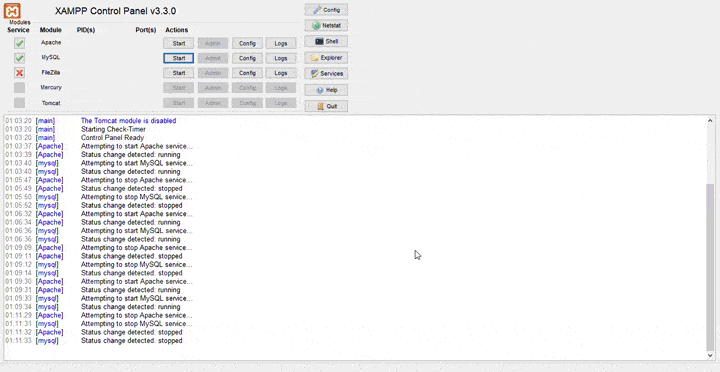

<h1 align="center">
  🪐 Titan Project
</h1>
<p align="center">
  Faites parti des premiers touristes de Titan.
</p>

<p align="center">
  
</p>

## 📋 informations

Il s'agit d'un formulaire dont il faut assurer la **validation en PHP**, ainsi que l'**enregistrement des données** en base de données **MySQL**.


## 🛠 set-up

1. Installation des prérequis.

- [XAMPP](https://www.apachefriends.org/index.html) - XAMPP est un environnement de développement PHP.
- [VS Code](https://code.visualstudio.com/) - Editeur pour écrire nos codes HTML, CSS, PHP.

2. Warning.

Le dossier Jupiter doit se trouver dans le répertoire suivant :

  ```sh
  C:\Program Files\xampp\htdocs
  ```

Utiliser XAMPP en mode administrateur. Le mode invité ou utilisateur bloque certaines fonctionnalités.

Si vous avez déjà installer MySQL sur votre machine, il faut changer le port MySQL dans XAMPP

   ```sh
    C:\Program Files\xampp\mysql\bin\my.ini
   ```
Changer le port 3306 en 3307 comme suit :

  ```sh
  port=3307
  socket="C:/Program Files/xampp/mysql/mysql.sock"
  ```

et ici :

  ```sh
  default-character-set=utf8mb4
  [mysqld]
  port=3307
  ```

## 🚀 build and run

1. Ouvrez le panneau de contrôle XAMPP et lancez les modules Apache et MySQL en appuyant sur **Start** sous la colonne **Actions**
2. Ouvrez la page de gestion de la base de données MySQL en cliquant sur la case **Admin** de la ligne MySQL et créez une base de données du même nom que le fichier db_conn.php. Dans notre cas la base de données se nomme test_db.
3. Une fois la base de données crée, il faut crée une table à l'aide de l'onglet **Opération**, du même nom que dans le code php, ici elle se nomme test. Il faut ensuite ajouter 3 colonnes (prénom, nom et email) en type VARCHAR(222) en cliquant sur l'onglet **Structure** et en ajoutant les colonnes une à une. Les colonnes correspondent aux informations récupérées par le formulaire. (J'ai crée une première colonne appelé id et coché la case AI : auto-incrémentation, qui permet de numéroter les personnes remplissant le formulaire).
4. Tout est prêt, vous n'avez plus qu'à ouvrir votre navigateur par défaut, vous rendre à l'adresse suivante : http://localhost/jupiter/index.html et remplir votre formulaire. Si vous remplissez correctement le formulaire (ne pas laisser de case vide) en cliquant sur la case de validation un message s'affiche pour dire que l'enregistrement s'est bien effectué. Dans le cas contraire, un message s'affiche aussi pour dire que l'enregistrement ne s'est pas bien effectué.

## Demo


